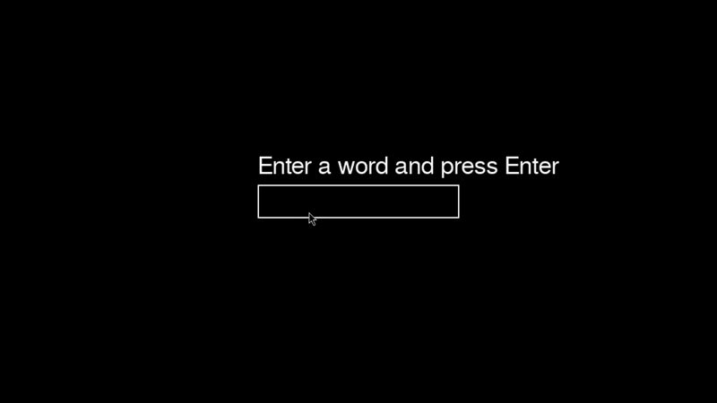

# Letter Collection Game with Deep Q-Learning AI

This is a Python game where an AI-controlled dot learns to collect letters in the correct order using **Deep Q-Learning (DQN)**. The game uses `pygame` for the interface and `PyTorch` for the deep learning model.

---

<p align="center">
  
</p>

---
## Features

- **AI Agent:** A dot controlled by a Deep Q-Learning agent.
- **Reinforcement Learning:** The agent learns to:
  - Move towards the correct letter.
  - Avoid wrong letters.
  - Collect letters in order to maximize reward.
- **Progress Rewards:**
  - Small reward for approaching the correct letter.
  - Penalty for approaching wrong letters.
  - Full reward for collecting the correct letter.
  - Penalty for collecting a wrong letter.
- **Persistent Learning:** The AI model is saved (`deep_ai_model.pth`) and loaded automatically on the next run.
- **Visual Interface:** Displays letters, the AI dot, target guidance line, score, and total reward.

---

## Installation

1. Clone this repository:

```bash
git clone https://github.com/nacttch/letter-collection-ai.git
cd letter-collection-ai
python ai.py
